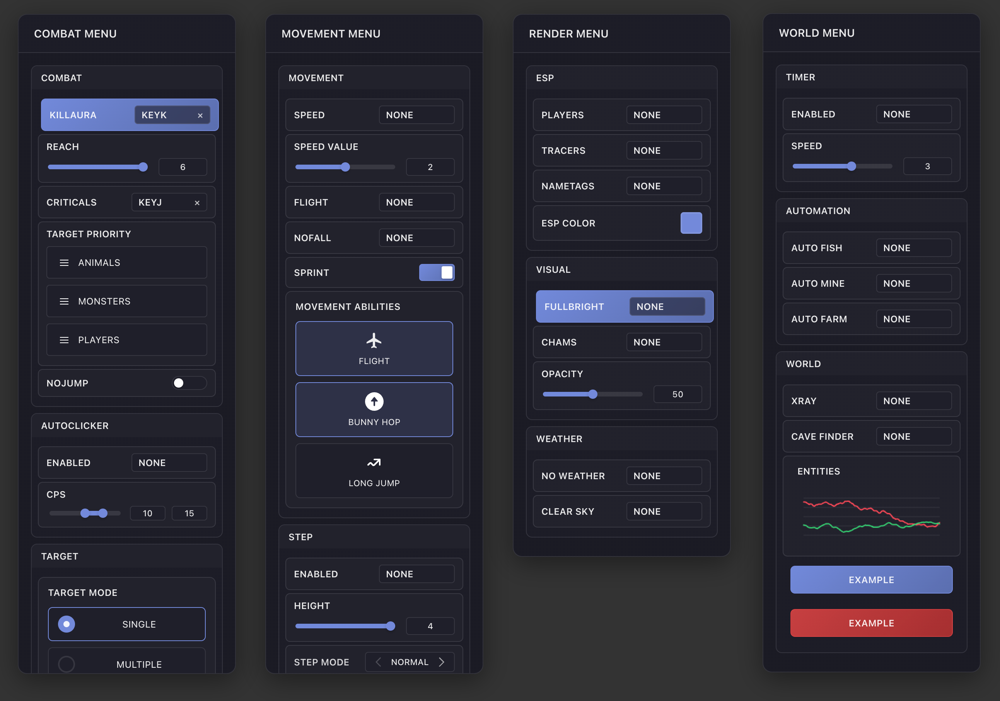

<div align="center">

# Frost-UI

A modern, lightweight UI library crafted for userscripts

[](https://github.com/FrozenProductions/Frost-UI/releases)
[](LICENSE)
[](https://github.com/FrozenProductions/Frost-UI)
[](DOCUMENTATION.md)

</div>

## 🌟 Overview

Frost-UI is an elegant and lightweight UI library designed specifically for userscripts. It provides a comprehensive suite of customizable components that help you create beautiful, interactive interfaces with minimal effort.

<div align="center">

</div>

## ✨ Features

### Interactive Components

-   **Core Elements**

    -   Draggable Menus
    -   Toast Notifications
    -   Toggle Switches
    -   Sliders
    -   Buttons
    -   Radio Groups
    -   Themes

-   **Advanced Inputs**
    -   Keybind Controls
    -   Dropdown Selectors
    -   Multi-select Menus
    -   Color Pickers
    -   Page Navigation

### Smart Management

-   Organized Category System
-   Automatic Configuration Saving
-   Keyboard Shortcut Support
-   Intelligent DOM Cleanup

## 🚀 Getting Started

### Installation

```js
// @require https://raw.githubusercontent.com/FrozenProductions/Frost-UI/main/scripts/Library.js
```

### Quick Start

```javascript
const menu = window.frostManager.addMenu(
    "uniqueId", // Unique identifier for the menu
    "Menu Title", // Display title
    { x: 100, y: 100 }, // Initial position (optional)
    "ShiftRight" // Toggle key (optional, defaults to 'ShiftRight')
);
```

## 💡 Key Features

-   **Intuitive Controls**: Toggle menus with ShiftRight (customizable)
-   **Smart Keybinds**: Automatic keybind conflict resolution
-   **Event System**: Comprehensive callback support
-   **Clean Design**: Automatic resource management

## 📚 Resources

-   [Full Documentation](DOCUMENTATION.md)
-   [Example Script](https://raw.githubusercontent.com/FrozenProductions/Frost-UI/main/scripts/example.user.js)

<div align="center">

## 💖 Support

If you find Frost-UI helpful, consider giving it a ⭐️

<br/>

Made with ❄️ by [FrozenProductions](https://github.com/FrozenProductions)

</div>
